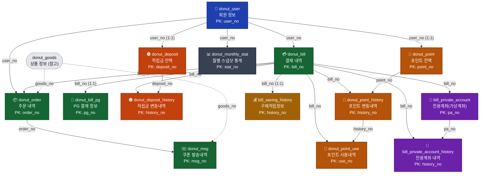
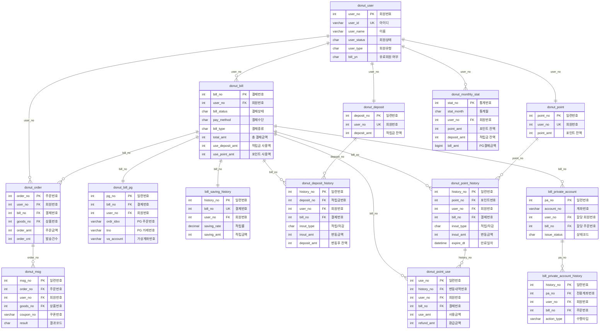

# 애드콘(도넛) 전산원장 테이블 관계도

> `create-tables.sql` 분석 문서. **애드콘_전산원장.png** 에 표시된 14개 핵심 원장(元帳) 테이블을 중심으로 관계와 데이터 흐름을 정리했습니다.
> DB(`3n1_db`)는 InnoDB이나 물리적 FK 제약이 없고, 모든 관계는 컬럼(`user_no`, `bill_no`, `order_no` 등)과 인덱스(KEY)로 연결되는 **논리적 관계**입니다.

---

## 1. 전산원장 핵심 테이블 (강조 대상)

| # | 테이블 | 설명(COMMENT) | PK | 주요 참조키 |
|---|--------|--------------|----|-------------|
| 🟦 | **donut_user** | 회원 정보 | `user_no` | — (모든 원장의 중심) |
| 🟩 | **donut_order** | 주문 내역 | `order_no` | `user_no`, `bill_no`, `goods_no` |
| 🟩 | **donut_bill** | 결제 내역 | `bill_no` | `user_no` |
| 🟩 | **donut_bill_pg** | PG 결제 정보 | `pg_no` | `bill_no`, `user_no` |
| 🟩 | **donut_msg** | 쿠폰 발송내역 | `msg_no` | `order_no`, `user_no`, `goods_no` |
| 🟧 | **donut_deposit** | 회원 적립금 잔액 | `deposit_no` | `user_no` (UNIQUE) |
| 🟧 | **donut_deposit_history** | 적립금 변동 상세내역 | `history_no` | `deposit_no`, `user_no`, `bill_no` |
| 🟧 | **donut_point** | 회원 도넛포인트 잔액 | `point_no` | `user_no` (UNIQUE) |
| 🟧 | **donut_point_history** | 도넛포인트 변동 상세내역 | `history_no` | `point_no`, `user_no`, `bill_no` |
| 🟧 | **donut_point_use** | 도넛포인트 사용 내역 | `use_no` | `history_no`, `user_no`, `bill_no` |
| 🟨 | **bill_saving_history** | 구매적립정보 상세내역 | `history_no` | `bill_no` (UNIQUE), `user_no` |
| 🟪 | **bill_private_account** | 전용계좌(고정식 가상계좌) 정보 | `pa_no` | `user_no`, `bill_no` |
| 🟪 | **bill_private_account_history** | 전용계좌 내역 | `history_no` | `pa_no`, `user_no`, `bill_no` |
| ⬜ | **donut_monthly_stat** | 회원 월별 스냅샷 통계 | `stat_no` | `user_no` |

색상 그룹: 🟦 회원 · 🟩 주문/결제 · 🟧 적립금·포인트 잔액/내역 · 🟨 구매적립 · 🟪 전용계좌 · ⬜ 통계

---

## 2. 관계도 (전산원장 중심)



> 실선(`─▶`)은 강조 원장 테이블 간 논리적 관계, 점선(`┄▶`)은 비강조 참조(`donut_goods`)입니다.

---

## 3. 상세 ER 다이어그램 (주요 컬럼)



---

## 4. 테이블 설명 (전산원장 중심)

### 4.1 중심 축 — `donut_user` (회원)
모든 원장의 기준점입니다. `user_no`(PK)가 결제·주문·적립금·포인트·통계 등 거의 모든 테이블에 외래키처럼 전파됩니다. `bill_yn`으로 유료회원 여부를, `user_status`/`user_type`/`grade`로 회원 상태를 관리합니다.

### 4.2 주문·결제 축 (🟩)
전산원장에서 **금전 거래의 두 허브**는 `donut_bill`(결제)과 `donut_order`(주문)입니다.

- **`donut_bill` (결제 내역)** — 결제의 최상위 단위이자 **정산의 핵심 원장**. `bill_no`가 적립금/포인트/구매적립/전용계좌 내역 전반으로 확산됩니다. 총 결제금액(`total_amt`), 실 결제액(`bill_amt`), 적립금 사용액(`use_deposit_amt`), 포인트 사용액(`use_point_amt`), 환불액 등 **결제 시 사용·환불된 자산을 집계**합니다.
- **`donut_bill_pg` (PG 결제 정보)** — 하나의 결제(`bill_no`)에 대한 PG사 상세 정보(거래번호 `tno`, 가상계좌 `va_account`, 카드/은행명 등). `donut_bill` 1건과 (보통) 1:1.
- **`donut_order` (주문 내역)** — 결제(`bill_no`) 안에서 실제 발송되는 상품(`goods_no`) 단위 주문. 발송단가/건수/성공·실패 건수를 관리. 한 결제에 여러 주문이 포함될 수 있습니다.
- **`donut_msg` (쿠폰 발송내역)** — 주문(`order_no`)으로부터 개별 수신자에게 발송되는 쿠폰(MMS/알림톡) 1건씩의 기록. 쿠폰번호·발송결과·사용시간·사용금액 등 쿠폰 라이프사이클을 담습니다.

### 4.3 적립금 축 (🟧 deposit)
- **`donut_deposit`** — 회원별 적립금 **현재 잔액**(회원당 1행, `user_no` UNIQUE).
- **`donut_deposit_history`** — 적립금 변동(적립/차감)의 **원장 상세**. 변동 시점의 결제(`bill_no`)와 변동 후 잔액(`deposit_amt`)을 함께 기록해 **잔액 스냅샷**을 남깁니다. 관리자 조정 시 `admin_no` 기록.

### 4.4 포인트 축 (🟧 point)
- **`donut_point`** — 회원별 도넛포인트 **현재 잔액**(회원당 1행).
- **`donut_point_history`** — 포인트 변동 **원장 상세**. 적립 포인트는 만료일(`expire_dt`)을 가지며 **선입선출(FIFO)** 로 차감됩니다.
- **`donut_point_use`** — 포인트 **사용**을 변동내역(`history_no`) 단위로 쪼갠 상세. 어떤 결제(`bill_no`)에서 얼마를 사용/환급했는지 추적(FIFO 차감 매핑용).

### 4.5 구매적립 축 (🟨)
- **`bill_saving_history`** — 결제(`bill_no`, UNIQUE로 1:1)에 대한 **구매 적립 정보**. 적립률(`saving_rate`), 적립금액(`saving_amt`), 취소금액(`cancel_amt`)을 기록. 결제→적립금 지급의 근거 원장.

### 4.6 전용계좌 축 (🟪)
- **`bill_private_account`** — 회원/주문에 할당되는 **고정식 가상계좌**. 은행코드+계좌번호가 유니크하며, 발급 상태(`issue_status`)로 재사용/만료를 관리.
- **`bill_private_account_history`** — 전용계좌(`pa_no`)의 상태 변경 이력(발급/할당/회수 등, 변경 전후 상태).

### 4.7 통계 축 (⬜)
- **`donut_monthly_stat`** — 회원별 **월말 스냅샷**. 통계월(`stat_month`) 기준 포인트/적립금 잔액, PG결제액, 도넛 지급·회수 금액을 저장하여 월별 원장 대사(對査)와 리포트에 활용.

---

## 5. 핵심 데이터 흐름

### (A) 결제 → 자산 사용/적립 흐름
```
donut_user ─▶ donut_bill ─┬─▶ donut_bill_pg        (PG/가상계좌 결제 상세)
                          ├─▶ bill_private_account  (무통장 가상계좌 발급/할당)
                          ├─▶ bill_saving_history   (구매 적립률·적립액 산정)
                          ├─▶ donut_deposit_history ─▶ (donut_deposit 잔액 갱신)
                          └─▶ donut_point_history ──▶ (donut_point 잔액 갱신)
                                     └─▶ donut_point_use  (FIFO 사용 매핑)
```
하나의 `bill_no`가 결제 수단(PG/가상계좌), 적립(구매적립), 자산 변동(적립금·포인트)을 **한 번에 묶는 정산 키**로 동작합니다.

### (B) 주문 → 쿠폰 발송 흐름
```
donut_bill ─▶ donut_order (goods_no별 주문/발송건수)
                  └─▶ donut_msg (수신자별 쿠폰 1건 = 발송·사용·환불 추적)
```

### (C) 잔액 원장 패턴 (적립금·포인트 공통)
```
잔액 테이블(donut_deposit / donut_point)  ← 현재 잔액 1행/회원
        ▲ 갱신
변동내역(*_history)  ← 매 트랜잭션 append, 변동후 잔액 스냅샷 보관
```
잔액 테이블은 "현재 상태", `*_history`는 "감사(監査) 가능한 원장"으로 이중 관리되어, **내역 합산 = 현재 잔액** 검증(대사)이 가능합니다. 이것이 이 스키마가 *전산원장*으로 불리는 이유입니다.

---

## 6. 참고 사항
- **물리 FK 없음**: 모든 관계는 컬럼명 + 보조 인덱스(KEY)로 구현된 논리적 관계입니다. 애플리케이션 레벨에서 무결성을 보장합니다.
- **`goods_no`(donut_goods)** 는 강조 대상은 아니지만 `donut_order`·`donut_msg`가 참조하는 상품 마스터로, 발송 상품/캠페인(CMS `goods_id`) 정보를 제공합니다.
- **잔액 스냅샷 컬럼**(`*_history`의 `deposit_amt`/`point_amt`): 변동 직후 잔액을 함께 저장해 시점별 잔액 추적 및 대사를 지원합니다.
